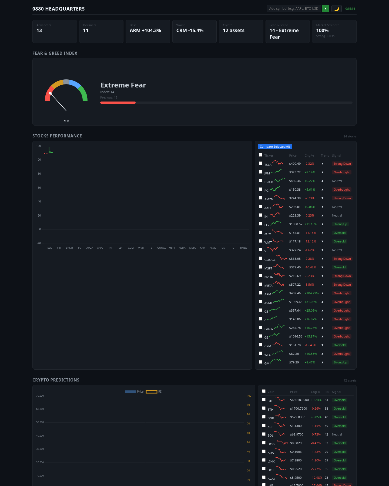

# 0880 Headquarters — Panel de Dashboard Financiero


Dashboard financiero en tiempo real con datos de mercado, indicadores técnicos, predicciones y gráficos interactivos para **acciones, criptomonedas y forex**. Todos los datos provienen de **APIs gratuitas** — no se requieren API keys ni suscripciones.

<p align="center">
  
</p>

---

## Tabla de Contenidos

- [Descripción General](#descripción-general)
- [Tecnologías y Lenguajes](#tecnologías-y-lenguajes)
- [Funcionalidades](#funcionalidades)
- [Arquitectura del Proyecto](#arquitectura-del-proyecto)
- [APIs del Backend](#apis-del-backend)
- [Uso Detallado](#uso-detallado)
- [Desarrollo y Personalización](#desarrollo-y-personalización)
- [Fuentes de Datos](#fuentes-de-datos)
- [Limitaciones Conocidas](#limitaciones-conocidas)
- [Licencia](#licencia)

---

## Descripción General

**0880 Headquarters** es una herramienta de monitoreo financiero todo-en-uno diseñada para operadores e inversores que necesitan tener el pulso del mercado en tiempo real desde un solo lugar.

El panel muestra simultáneamente:

- **103 acciones** de EE.UU. (incluyendo NVDA, AAPL, MSFT, GOOGL, AMZN, META, TSLA y más)
- **30+ criptomonedas** ordenadas por capitalización de mercado via CoinGecko
- **16 pares forex** mayores y cruzados
- **Análisis técnico** completo con RSI, MACD, Bandas de Bollinger, soportes, resistencias, volatilidad y divergencias
- **Matriz de correlación** entre las 15 acciones principales
- **Portafolio personal** con P&L en vivo
- **Alertas de precio** con notificaciones del navegador
- **Lista de seguimiento** personalizada

---

## Tecnologías y Lenguajes

### Backend

| Tecnología | Versión | Uso |
|------------|---------|-----|
| **Python** | 3.12 | Lenguaje principal del servidor |
| **FastAPI** | 0.115+ | Framework web ASGI para los endpoints REST |
| **Uvicorn** | 0.34+ | Servidor ASGI de alto rendimiento |
| **HTTPX** | 0.28+ | Cliente HTTP asíncrono para consumir APIs externas |

### Frontend

| Tecnología | Versión | Uso |
|------------|---------|-----|
| **JavaScript (ES6+)** | — | Lógica del dashboard en el navegador |
| **HTML5** | — | Estructura de la interfaz |
| **CSS3** | — | Estilos con variables CSS para temas oscuro/claro |
| **Chart.js** | 4.4 | Visualización de gráficos financieros (barras, líneas, radar, etc.) |

### Infraestructura

| Tecnología | Uso |
|------------|-----|
| **Docker** | Contenedorización del entorno completo |
| **Docker Compose** | Orquestación del servicio |

---

## Funcionalidades

### 📊 Resumen del Mercado

- **Índice de Miedo y Codicia** — Medidor analógico + barra de progreso desde alternative.me
- **Medidor de Fuerza del Mercado** — Compuesto ponderado de RSI, MACD, EMA, Bandas de Bollinger y Volumen sobre SPY
- **Tarjetas de Resumen** — Avances/Retrocesos del día, mejor/peor rendimiento, conteo de activos cripto

### 📈 Acciones y Cripto

- **Pool Dinámico** — 103 acciones en total; 15 siempre incluidas (NVDA, AAPL, MSFT, GOOGL, AMZN, META, TSLA, BRK-B, JPM, V, LLY, XOM, WMT, JNJ, PG) + 25 seleccionadas aleatoriamente cada ciclo; las 24 mejores por movimiento absoluto se muestran
- **Cripto por Capitalización** — Top 30 de CoinGecko + 10 core siempre incluidas (BTC, ETH, SOL, BNB, XRP, ADA, DOGE, DOT, AVAX, LINK); top 12 mostradas
- **Gráfico de Barras** — Distribución del % de cambio con código de colores verde/rojo
- **Gráfico de Eje Dual** — Barras de precio de cripto superpuestas con línea RSI
- **Rendimiento por Sector** — Gráfico de barras agrupado por sector (Tecnología, Finanzas, Salud, etc.)

### 💱 Forex

- **16 pares principales**: EUR/USD, GBP/USD, USD/JPY, EUR/JPY, GBP/JPY, AUD/JPY, CHF/JPY, EUR/AUD, GBP/AUD, EUR/CHF, AUD/NZD, USD/CHF, USD/CAD, AUD/USD, NZD/USD, EUR/GBP
- **Mapa de calor** horizontal con barras proporcionales al cambio porcentual

### 🔬 Análisis Técnico (Modal de Detalle)

Al hacer clic en cualquier símbolo se abre un modal con análisis completo:

- **Gráfico de Precios** — Velas con Bandas de Bollinger y pronóstico de regresión lineal
- **Historial RSI** — Niveles de sobrecompra (70) y sobreventa (30)
- **MACD** — Línea MACD, línea de señal e histograma
- **Volumen** — Barras de volumen con comparación día anterior
- **Soporte y Resistencia** — Niveles calculados automáticamente
- **Volatilidad** — Medición porcentual
- **Divergencias** — Detección automática de divergencias alcistas/bajistas entre precio y RSI
- **Predicción** — Estimación de dirección del siguiente día con nivel de confianza
- **Múltiples Timeframes**: 1 día, 5 días, 1 mes, 3 meses, 6 meses, 1 año

### 🛠 Herramientas

| Herramienta | Descripción |
|-------------|-------------|
| **Buscador de Símbolos** | Busca cualquier activo en Yahoo Finance y agrégalo a tu watchlist |
| **Watchlist** | Lista de seguimiento persistente en localStorage con precio/RSI/señal |
| **Alertas de Precio** | Configura umbrales > o <, recibe notificaciones del navegador sin duplicados |
| **Comparador** | Selecciona 2+ activos, superpone rendimientos normalizados en un gráfico |
| **Portafolio** | Registra tus tenencias (símbolo, cantidad, costo promedio); calcula valor actual, P&L y retorno % |
| **Matriz de Correlación** | Correlación de Pearson entre 15 acciones core basada en rendimientos diarios a 3 meses |
| **Exportar CSV** | Descarga datos históricos del activo seleccionado |
| **Exportar PDF** | Imprime el modal de detalle |
| **Tablas Ordenables** | Haz clic en cualquier encabezado de columna para ordenar ascendente/descendente |
| **Mapa de Calor Semanal** | Tabla de rendimientos diarios (Lun–Vie) codificados por color para todos los activos |
| **Tema Oscuro/Claro** | Alterna entre temas con persistencia automática |

### 🔄 Auto-Actualización

- Ciclo de actualización cada **30 segundos**
- Sistema de caché en memoria del backend con TTL de **60–600 segundos** según el endpoint
- Las tablas, gráficos, portafolio, watchlist y alertas se actualizan simultáneamente

---

## Arquitectura del Proyecto

```
financial-panel/
│
├── docker-compose.yml          # Configuración Docker (network_mode: host)
├── Dockerfile                  # Python 3.12-slim + uvicorn
├── requirements.txt            # Dependencias Python
├── README.md                   # Documentación
├── assets/
│   └── dashboard-preview.png   # Captura de pantalla del dashboard
│
├── app/
│   ├── main.py                 # Backend FastAPI (~870 líneas)
│   │   ├── Endpoints REST       # 10 endpoints API
│   │   ├── Caché en memoria     # CacheManager con TTL configurable
│   │   ├── Pool de acciones     # 103 símbolos con selección dinámica
│   │   ├── Cálculos técnicos    # RSI, MACD, BB, SMA, regresión lineal
│   │   ├── Detección div.       # Divergencias RSI/precio
│   │   └── Noticias RSS         # Parser de feeds Yahoo Finance
│   │
│   └── static/
│       ├── index.html           # Interfaz de usuario (HTML5)
│       ├── style.css            # Estilos con variables CSS (~188 líneas)
│       └── script.js            # Lógica frontend (~785 líneas)
│           ├── Chart.js configs  # 4 gráficos principales + 4 detalle
│           ├── Tablas dinámicas  # Stocks, crypto, forex, watchlist
│           ├── State management  # Sorting, portfolio, alerts, theme
│           └── Auto-refresh      # setInterval 30s con Promise.all
```

### Flujo de Datos

```
APIs Externas                    Backend (FastAPI)              Frontend (JS)
─────────────                    ────────────────              ─────────────
Yahoo Finance v8  ───►  CacheManager ───► /api/stocks       ───► Chart.js
CoinGecko         ───►  (TTL 60-600s) ───► /api/crypto      ───► Tablas ordenables
Alternative.me    ───►               ───► /api/forex        ───► Modal detalle
Yahoo RSS         ───►               ───► /api/detail       ───► Watchlist
                                      ───► /api/correlation ───► Matriz correlación
                                      ───► /api/news        ───► Noticias
                                                              ───► Portafolio (localStorage)
```

---

## APIs del Backend

### Endpoints Principales

| Método | Endpoint | Parámetros | Descripción | Cache TTL |
|--------|----------|-------------|-------------|-----------|
| GET | `/api/fear-greed` | — | Índice de Miedo y Codicia | 300s |
| GET | `/api/stocks` | — | 24 acciones con mejor/peor rendimiento | 60s |
| GET | `/api/crypto` | — | 12 criptos del top CoinGecko | 60s |
| GET | `/api/forex` | — | 12 pares forex con mayor movimiento | 60s |
| GET | `/api/indicators` | — | Indicadores técnicos de SPY | 300s |
| GET | `/api/correlation` | — | Matriz de correlación 15 acciones | 600s |

### Endpoints con Parámetros

| Método | Endpoint | Parámetros | Descripción |
|--------|----------|-------------|-------------|
| GET | `/api/detail` | `symbol` (req), `timeframe` (opc: 1d/5d/1mo/3mo/6mo/1y/2y) | Análisis técnico completo |
| GET | `/api/compare` | `symbols` (req, separados por coma) | Rendimientos normalizados |
| GET | `/api/news` | `symbol` (req) | Noticias RSS del símbolo |
| GET | `/api/lookup` | `symbol` (req) | Búsqueda de símbolo en Yahoo |

### Ejemplos de Uso

```bash
# Obtener acciones destacadas
curl http://localhost:8000/api/stocks

# Análisis técnico de NVIDIA en timeframe 6 meses
curl "http://localhost:8000/api/detail?symbol=NVDA&timeframe=6mo"

# Comparar rendimientos de AAPL, MSFT y GOOGL
curl "http://localhost:8000/api/compare?symbols=AAPL,MSFT,GOOGL"

# Noticias de Bitcoin
curl "http://localhost:8000/api/news?symbol=BTC-USD"

# Buscar un símbolo
curl "http://localhost:8000/api/lookup?symbol=TSLA"

# Matriz de correlación
curl http://localhost:8000/api/correlation
```

### Estructura de Respuesta (Ejemplo: `/api/detail`)

```json
{
  "symbol": "NVDA",
  "price": 876.54,
  "change_pct": 2.34,
  "currency": "USD",
  "rsi": 62.5,
  "volatility": 1.83,
  "support": 845.20,
  "resistance": 890.10,
  "trend": "uptrend",
  "trend_strength": "strong",
  "prices": [845.2, 848.1, ...],
  "dates": ["2025-01-15", "2025-01-16", ...],
  "volumes": [12345678, 9876543, ...],
  "rsi_history": [58.3, 59.1, ...],
  "macd": [12.3, 13.1, ...],
  "macd_signal": [11.5, 11.8, ...],
  "bb_upper": [860.1, 862.3, ...],
  "bb_middle": [850.0, 851.2, ...],
  "bb_lower": [839.9, 840.1, ...],
  "weekly_returns": {
    "Mon": 1.23,
    "Tue": -0.45,
    "Wed": 0.78,
    "Thu": 2.10,
    "Fri": -0.32
  },
  "divergences": [
    {"type": "bullish", "message": "RSI bullish divergence detected"}
  ],
  "prediction": {
    "next_day": 885.20,
    "direction": "up",
    "confidence": 0.68
  },
  "sector": "Technology"
}
```

---

## Uso Detallado

### Inicio Rápido

```bash
# Requisito: Docker y Docker Compose instalados

# Clonar el repositorio
git clone https://github.com/dev1lsconf/financial-panel.git
cd financial-panel

# Iniciar el dashboard
docker compose up -d

# Abrir en el navegador
open http://localhost:8000
```

### Después de Modificar Archivos

```bash
docker compose down
docker build --no-cache --network host -t financial-panel-panel .
docker compose up -d
```

### Gestión del Servicio

```bash
# Ver logs
docker compose logs -f

# Detener
docker compose down

# Reiniciar
docker compose restart
```

### Guía de Uso de la Interfaz

1. **Explorar Mercado**: Al abrir el dashboard, los datos se cargan automáticamente. Las tablas y gráficos se actualizan cada 30 segundos.

2. **Ver Detalle de un Activo**: Haz clic en cualquier fila de las tablas (stocks, crypto, forex) para abrir el modal de análisis técnico completo.

3. **Cambiar Timeframe**: Dentro del modal de detalle, usa los botones 1D, 5D, 1M, 3M, 6M, 1Y para ver diferentes períodos.

4. **Buscar Símbolos**: Usa la barra de búsqueda en el header para agregar cualquier símbolo a tu watchlist (ej: AAPL, BTC-USD, EURUSD=X).

5. **Comparar Activos**: Marca 2+ activos con los checkboxes y haz clic en "Compare Selected" para ver rendimientos superpuestos.

6. **Portafolio**: En la sección "My Portfolio", ingresa símbolo, cantidad y costo promedio para trackear tus posiciones en vivo.

7. **Alertas**: Configura alertas de precio (> o <) y recibe notificaciones del navegador cuando se activen.

8. **Exportar**: Desde el modal de detalle, puedes descargar CSV o imprimir/exportar a PDF.

9. **Tema**: Usa el botón `🌙`/`☀️` en el header para alternar entre tema oscuro y claro.

---

## Desarrollo y Personalización

### Requisitos Locales (sin Docker)

```bash
python3 -m venv venv
source venv/bin/activate
pip install -r requirements.txt
uvicorn app.main:app --host 0.0.0.0 --port 8000 --reload
```

### Requisitos

```
Python >= 3.12
Docker >= 24.0 (recomendado)
Docker Compose >= 2.20
```

### Estructura de Dependencias

```
requirements.txt
├── fastapi          # Framework web
├── uvicorn          # Servidor ASGI
└── httpx            # Cliente HTTP asíncrono
```

### Personalización de Estilos

El tema visual se controla mediante **variables CSS** en `app/static/style.css`:

```css
:root {
  --bg: #0d1117;       /* Fondo principal */
  --bg2: #161b22;      /* Fondo secundario */
  --text: #c9d1d9;     /* Color de texto */
  --green: #3fb950;    /* Valor positivo */
  --red: #f85149;      /* Valor negativo */
  --blue: #58a6ff;     /* Enlaces/accent */
}
```

Para el tema claro, se modifican las mismas variables bajo `.light`.

---

## Fuentes de Datos

| Fuente | Endpoint | Uso | Límite de Velocidad |
|--------|----------|-----|---------------------|
| [Yahoo Finance](https://finance.yahoo.com/) | `v8/finance/chart` | OHLCV, RSI, MACD, BB, SMA | ~10 req/min por IP (soft limit) |
| [CoinGecko](https://www.coingecko.com/) | `/api/v3/coins/markets` | Capitalización, precios, ranking cripto | ~30 req/min (free tier) |
| [Alternative.me](https://alternative.me/crypto/fear-and-greed-index/) | `/fng/` | Índice de Miedo y Codicia | Sin límite conocido |
| Yahoo RSS | `feeds.finance.yahoo.com/rss/2.0/headline` | Noticias por símbolo | Sin límite conocido |

### Política de Caché

Para evitar rate limiting, el backend implementa un caché en memoria:

| Endpoint | TTL |
|----------|-----|
| `/api/stocks` | 60s |
| `/api/crypto` | 60s |
| `/api/forex` | 60s |
| `/api/detail` | 60s |
| `/api/compare` | 60s |
| `/api/fear-greed` | 300s |
| `/api/indicators` | 300s |
| `/api/news` | 120s |
| `/api/correlation` | 600s |
| `/api/lookup` | 3600s |

---

## Limitaciones Conocidas

1. **Yahoo Finance Rate Limiting**: Las APIs de screener/quote/tendencias devuelven HTTP 429 desde este entorno. Como solución, se utiliza un pool fijo de 103 acciones que se ordenan por movimiento en tiempo real.

2. **Criptomonedas sin mapping**: Algunas criptos del top 30 de CoinGecko no tienen un símbolo equivalente en Yahoo Finance y se omiten automáticamente.

3. **CoinGecko Free Tier**: Límite de ~30 llamadas por minuto. Mitigado con caché de 60s en los endpoints de cripto.

4. **Docker Rootless**: En entornos rootless, Docker no tiene forwarding IPv4 nativo. Se requiere `network_mode: host` en docker-compose.yml.

5. **Conexiones Simultáneas**: El panel realiza 5 llamadas API simultáneas cada 30 segundos. En conexiones lentas puede haber latencia acumulativa.

---

## Licencia

MIT © 2025 — Este proyecto es de código abierto. Puedes usarlo, modificarlo y distribuirlo libremente.

---

<p align="center">
  <sub>Hecho con ☕ por dev1lsconf</sub>
</p>
